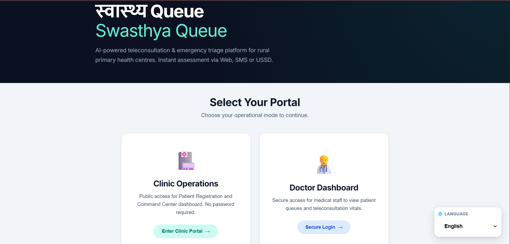
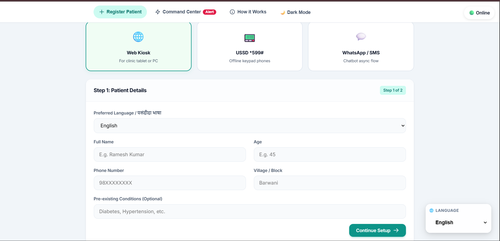
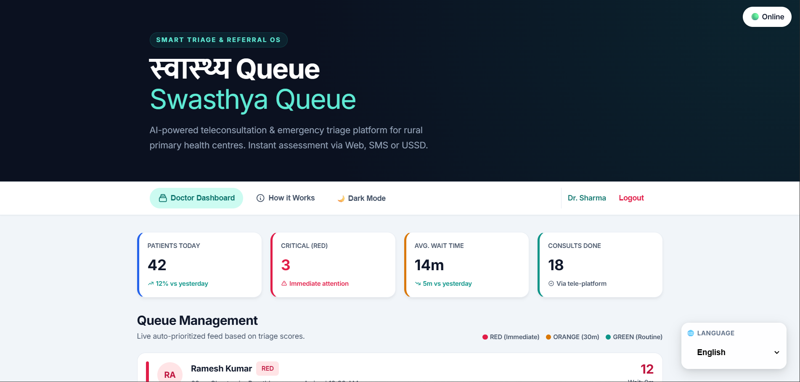
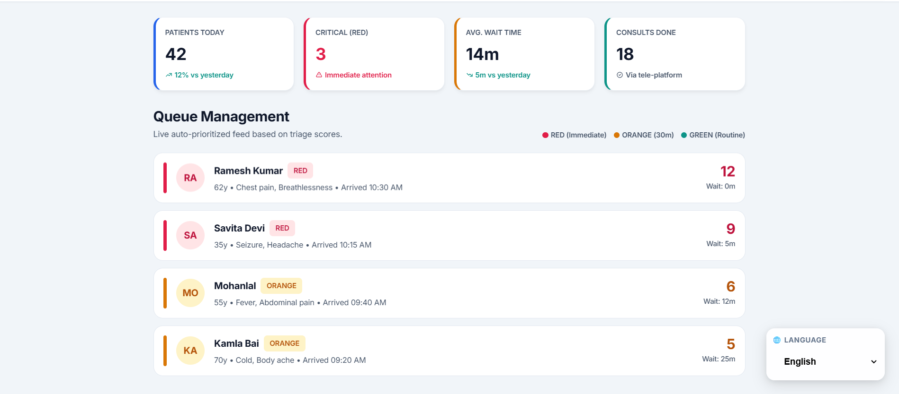

<div align="center">

# 🏥 Swasthya Queue

### Smart Healthcare Queue Management System

Reduce patient waiting time, streamline hospital operations, and provide a seamless digital queue experience.


</div>

---

# 📖 Overview

Swasthya Queue is a healthcare queue management platform designed to digitize the patient registration and consultation process.

Instead of waiting in long physical queues, patients can register digitally, receive a token number, monitor their queue status in real-time, and receive notifications when their turn approaches.

The system helps hospitals, clinics, and healthcare centers improve operational efficiency while enhancing the patient experience.

---

# ✨ Features

## 👨‍⚕️ Patient

- Digital Registration
- Generate Queue Token
- Live Queue Status
- Estimated Waiting Time
- Appointment Tracking
- Mobile Friendly Interface

## 🏥 Hospital

- Queue Dashboard
- Patient Management
- Token Management
- Consultation Status
- Queue Analytics
- Daily Reports

## 🔐 Authentication

- Secure Login
- Role Based Access
- Patient Login
- Admin Login

---

# 🚀 Tech Stack

## Frontend

- React.js
- Tailwind CSS
- JavaScript
- HTML5
- CSS3

## Backend

- Node.js
- Express.js

## Database

- MongoDB

## Authentication

- JWT

## Other Tools

- Git
- GitHub
- REST API

---

# 📂 Project Structure

```
Swasthya-Queue
│
├── client/
│   ├── src/
│   ├── public/
│   └── package.json
│
├── server/
│   ├── controllers/
│   ├── models/
│   ├── routes/
│   ├── middleware/
│   ├── config/
│   └── server.js
│
├── README.md
├── LICENSE
└── .gitignore
```

---

# ⚙️ Installation

## Clone Repository

```bash
git clone https://github.com/Sricharan-S12/Swasthya-Queue.git
```

Go inside the project

```bash
cd Swasthya-Queue
```

---

## Install Frontend

```bash
cd client
npm install
```

Run frontend

```bash
npm run dev
```

---

## Install Backend

```bash
cd server
npm install
```

Run backend

```bash
npm start
```

---

# 🔑 Environment Variables

Create a `.env` file inside the backend.

```env
PORT=5000

MONGODB_URI=your_database_url

JWT_SECRET=your_secret_key

CLIENT_URL=http://localhost:5173
```

---

# 📸 Screenshots

## Home Page



---

## Clinic Dashboard



---

## Admin Dashboard



---

## Queue Status



---

# 📌 Workflow

```
Patient Registration
        │
        ▼
Token Generation
        │
        ▼
Waiting Queue
        │
        ▼
Doctor Consultation
        │
        ▼
Completed
```

---

# 🎯 Future Enhancements

- 📱 Mobile Application
- 🔔 SMS Notifications
- 📧 Email Alerts
- 💳 Online Payments
- 🤖 AI Queue Prediction
- 📊 Analytics Dashboard
- 🌐 Multi-language Support
- ☁️ Cloud Deployment

---

# 🤝 Contributing

We welcome contributions from everyone.

### Steps

1. Fork the repository

2. Create a new branch

```bash
git checkout -b feature-name
```

3. Commit your changes

```bash
git commit -m "Add new feature"
```

4. Push your branch

```bash
git push origin feature-name
```

5. Open a Pull Request

---

# 📜 Code of Conduct

Please follow respectful and collaborative communication while contributing.

---

# 🐞 Reporting Bugs

Found a bug?

Create an issue describing:

- Expected behavior
- Actual behavior
- Steps to reproduce
- Screenshots (if any)

---

# 💡 Feature Requests

Have an idea?

Open an issue with the **Feature Request** label.

---

# ⭐ Support

If you find this project useful:

⭐ Star the repository

🍴 Fork it

🛠️ Contribute

📢 Share it with others

---

# 📄 License

This project is licensed under the MIT License.

---

<div align="center">

### Made with ❤️ by the Swasthya Queue Contributors

</div>
